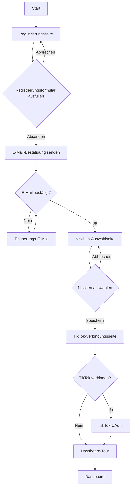
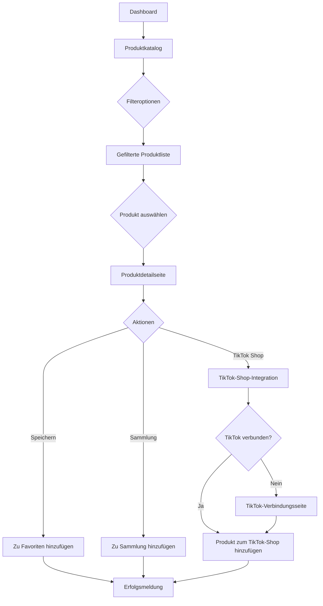
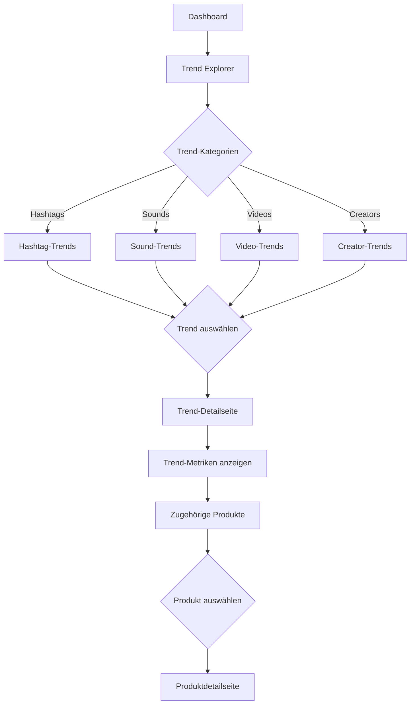

# Benutzerfluss-Diagramme für die TikTok Produkt-Empfehlungsplattform

## Hauptbenutzerflüsse

### 1. Onboarding-Prozess

```
[Start] → Registrierung → E-Mail-Bestätigung → Nischen-Auswahl → TikTok-Konto verbinden (optional) → Dashboard-Tour → [Dashboard]
```

**Details:**
1. **Registrierung**: Benutzer gibt E-Mail, Passwort und persönliche Daten ein
2. **E-Mail-Bestätigung**: Benutzer bestätigt E-Mail-Adresse
3. **Nischen-Auswahl**: Benutzer wählt primäre Nische (Fitness) und sekundäre Nischen
4. **TikTok-Konto verbinden**: Optional kann der Benutzer sein TikTok-Konto verbinden
5. **Dashboard-Tour**: Kurze Einführung in die Hauptfunktionen der Plattform
6. **Dashboard**: Benutzer landet auf dem personalisierten Dashboard

### 2. Produkt-Entdeckung

```
[Dashboard] → Produktkatalog → Filterung/Suche → Produktdetails → Produkt speichern/Zur Sammlung hinzufügen → TikTok-Shop-Integration → [Erfolg]
```

**Details:**
1. **Dashboard**: Benutzer startet vom Dashboard
2. **Produktkatalog**: Benutzer navigiert zum Produktkatalog
3. **Filterung/Suche**: Benutzer filtert nach Kategorie, Preis, Trendpotenzial etc.
4. **Produktdetails**: Benutzer sieht detaillierte Produktinformationen
5. **Produkt speichern**: Benutzer speichert Produkt oder fügt es einer Sammlung hinzu
6. **TikTok-Shop-Integration**: Benutzer kann Produkt direkt in seinen TikTok-Shop importieren
7. **Erfolg**: Bestätigung der erfolgreichen Aktion

### 3. Trend-Analyse

```
[Dashboard] → Trend Explorer → Trend-Kategorie auswählen → Trend-Details → Zugehörige Produkte anzeigen → Produkt auswählen → [Produktdetails]
```

**Details:**
1. **Dashboard**: Benutzer startet vom Dashboard
2. **Trend Explorer**: Benutzer navigiert zum Trend Explorer
3. **Trend-Kategorie**: Benutzer wählt eine Trend-Kategorie (Hashtags, Sounds, etc.)
4. **Trend-Details**: Benutzer sieht detaillierte Trend-Informationen und Metriken
5. **Zugehörige Produkte**: Benutzer sieht Produkte, die mit dem Trend verbunden sind
6. **Produkt auswählen**: Benutzer wählt ein Produkt aus
7. **Produktdetails**: Benutzer sieht detaillierte Produktinformationen

### 4. Content-Ideenfindung

```
[Produktdetails] → Content-Ideen anzeigen → Idee auswählen → Idee anpassen → Idee speichern → [Gespeicherte Ideen]
```

**Details:**
1. **Produktdetails**: Benutzer startet von der Produktdetailseite
2. **Content-Ideen anzeigen**: Benutzer sieht vorgeschlagene Content-Ideen für das Produkt
3. **Idee auswählen**: Benutzer wählt eine Content-Idee aus
4. **Idee anpassen**: Benutzer kann die Idee an seine Bedürfnisse anpassen
5. **Idee speichern**: Benutzer speichert die angepasste Idee
6. **Gespeicherte Ideen**: Benutzer kann alle gespeicherten Ideen einsehen

### 5. Sammlung erstellen und verwalten

```
[Dashboard] → Sammlungen → Neue Sammlung erstellen → Sammlung benennen → Produkte hinzufügen → Sammlung speichern → [Sammlungsübersicht]
```

**Details:**
1. **Dashboard**: Benutzer startet vom Dashboard
2. **Sammlungen**: Benutzer navigiert zu seinen Sammlungen
3. **Neue Sammlung**: Benutzer erstellt eine neue Sammlung
4. **Sammlung benennen**: Benutzer gibt der Sammlung einen Namen und Beschreibung
5. **Produkte hinzufügen**: Benutzer fügt Produkte zur Sammlung hinzu
6. **Sammlung speichern**: Benutzer speichert die Sammlung
7. **Sammlungsübersicht**: Benutzer sieht alle seine Sammlungen

### 6. Analytics einsehen

```
[Dashboard] → Analytics Center → Zeitraum auswählen → Metriken anzeigen → Bericht exportieren → [Dashboard]
```

**Details:**
1. **Dashboard**: Benutzer startet vom Dashboard
2. **Analytics Center**: Benutzer navigiert zum Analytics Center
3. **Zeitraum auswählen**: Benutzer wählt den zu analysierenden Zeitraum
4. **Metriken anzeigen**: Benutzer sieht verschiedene Performance-Metriken
5. **Bericht exportieren**: Benutzer kann einen Bericht exportieren
6. **Dashboard**: Benutzer kehrt zum Dashboard zurück

### 7. Abonnement verwalten

```
[Profil] → Abonnement → Abonnement anzeigen → Plan ändern → Zahlungsinformationen aktualisieren → Bestätigen → [Erfolg]
```

**Details:**
1. **Profil**: Benutzer navigiert zu seinem Profil
2. **Abonnement**: Benutzer wählt Abonnement-Einstellungen
3. **Abonnement anzeigen**: Benutzer sieht aktuellen Abonnement-Status
4. **Plan ändern**: Benutzer kann seinen Plan upgraden oder downgraden
5. **Zahlungsinformationen**: Benutzer aktualisiert Zahlungsinformationen
6. **Bestätigen**: Benutzer bestätigt die Änderungen
7. **Erfolg**: Bestätigung der erfolgreichen Aktion

## Detaillierte Benutzerflüsse

### Onboarding-Prozess



### Produkt-Entdeckung



### Trend-Analyse



## Benutzerinteraktionen

### Dashboard-Interaktionen

- **Widget-Anpassung**: Benutzer kann Widgets auf dem Dashboard hinzufügen, entfernen und neu anordnen
- **Schnellzugriff**: Benutzer kann häufig verwendete Funktionen als Schnellzugriff hinzufügen
- **Benachrichtigungen**: Benutzer erhält Benachrichtigungen über neue Trends und Produktempfehlungen
- **Datenaktualisierung**: Dashboard-Daten werden automatisch oder manuell aktualisiert

### Produktkatalog-Interaktionen

- **Filterung**: Benutzer kann Produkte nach verschiedenen Kriterien filtern
- **Sortierung**: Benutzer kann Produkte nach verschiedenen Kriterien sortieren
- **Suche**: Benutzer kann nach Produkten suchen
- **Listenansicht/Rasteransicht**: Benutzer kann zwischen verschiedenen Ansichten wechseln
- **Pagination**: Benutzer kann durch Seiten mit Produkten navigieren

### Produktdetail-Interaktionen

- **Bildergalerie**: Benutzer kann durch Produktbilder navigieren
- **Produktinformationen**: Benutzer kann detaillierte Produktinformationen einsehen
- **Trend-Daten**: Benutzer kann Trend-Daten zum Produkt einsehen
- **Content-Ideen**: Benutzer kann Content-Ideen zum Produkt einsehen
- **Aktionen**: Benutzer kann verschiedene Aktionen für das Produkt ausführen

### Trend Explorer-Interaktionen

- **Kategorie-Auswahl**: Benutzer kann zwischen verschiedenen Trend-Kategorien wechseln
- **Zeitraum-Auswahl**: Benutzer kann den zu analysierenden Zeitraum auswählen
- **Trend-Visualisierung**: Benutzer kann Trends in verschiedenen Visualisierungen betrachten
- **Trend-Vergleich**: Benutzer kann Trends miteinander vergleichen
- **Trend-Prognose**: Benutzer kann Prognosen für Trends einsehen

### Content Studio-Interaktionen

- **Ideen-Generierung**: Benutzer kann Content-Ideen generieren lassen
- **Ideen-Anpassung**: Benutzer kann Content-Ideen anpassen
- **Ideen-Speicherung**: Benutzer kann Content-Ideen speichern
- **Ideen-Organisation**: Benutzer kann Content-Ideen organisieren
- **Ideen-Export**: Benutzer kann Content-Ideen exportieren

## Fehlerbehandlung und Edge Cases

### Registrierung und Anmeldung

- **Ungültige E-Mail**: Benutzer erhält Fehlermeldung und kann E-Mail korrigieren
- **Schwaches Passwort**: Benutzer erhält Hinweise zur Passwort-Stärke
- **Bereits registrierte E-Mail**: Benutzer erhält Hinweis und kann sich anmelden
- **Fehlgeschlagene Anmeldung**: Benutzer erhält Fehlermeldung und kann Anmeldedaten korrigieren

### TikTok-Integration

- **Fehlgeschlagene Verbindung**: Benutzer erhält Fehlermeldung und kann erneut versuchen
- **Abgelaufene Autorisierung**: Benutzer wird aufgefordert, TikTok-Konto erneut zu verbinden
- **Fehlende Berechtigungen**: Benutzer erhält Hinweis auf fehlende Berechtigungen

### Produktsuche und -filterung

- **Keine Ergebnisse**: Benutzer erhält Hinweis und alternative Suchvorschläge
- **Zu viele Ergebnisse**: Benutzer erhält Hinweis zur Verfeinerung der Suche
- **Nicht verfügbare Produkte**: Produkte werden als nicht verfügbar markiert

### Abonnement und Zahlung

- **Fehlgeschlagene Zahlung**: Benutzer erhält Fehlermeldung und kann Zahlungsinformationen korrigieren
- **Abgelaufenes Abonnement**: Benutzer erhält Hinweis und kann Abonnement erneuern
- **Downgrade-Einschränkungen**: Benutzer erhält Hinweis auf Einschränkungen beim Downgrade

## Responsive Design-Anpassungen

### Desktop-Version

- Vollständige Funktionalität mit komplexen Visualisierungen
- Multi-Panel-Layouts für gleichzeitige Anzeige verschiedener Informationen
- Hover-Effekte für zusätzliche Informationen
- Keyboard-Shortcuts für häufig verwendete Funktionen

### Tablet-Version

- Angepasste Layouts für mittlere Bildschirmgrößen
- Reduzierte Multi-Panel-Layouts
- Touch-optimierte Interaktionen
- Vereinfachte Visualisierungen

### Mobile-Version

- Stark vereinfachte Layouts für kleine Bildschirmgrößen
- Single-Panel-Layouts mit Navigation zwischen Ansichten
- Touch-optimierte Interaktionen mit größeren Touch-Targets
- Fokus auf wesentliche Funktionen und Informationen
